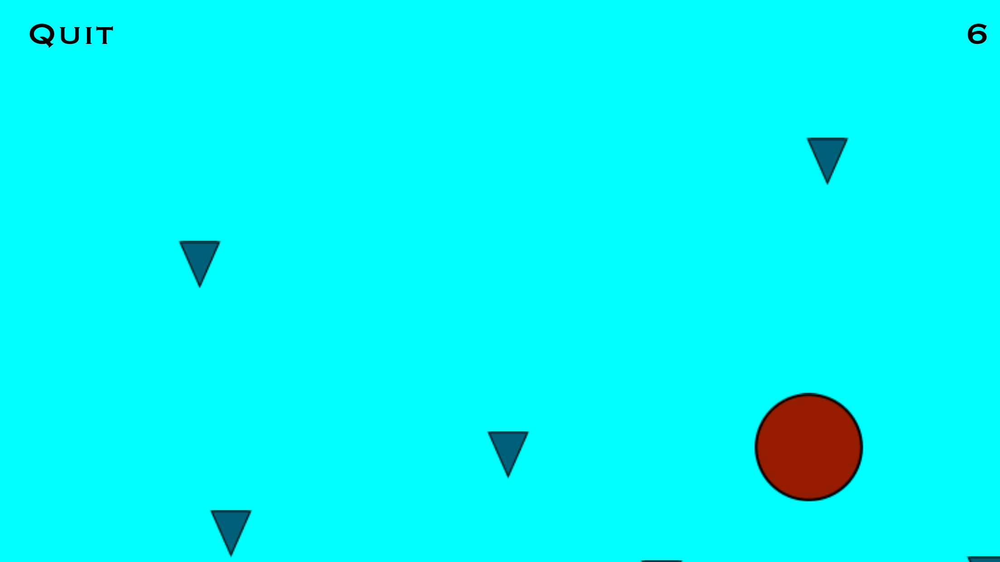
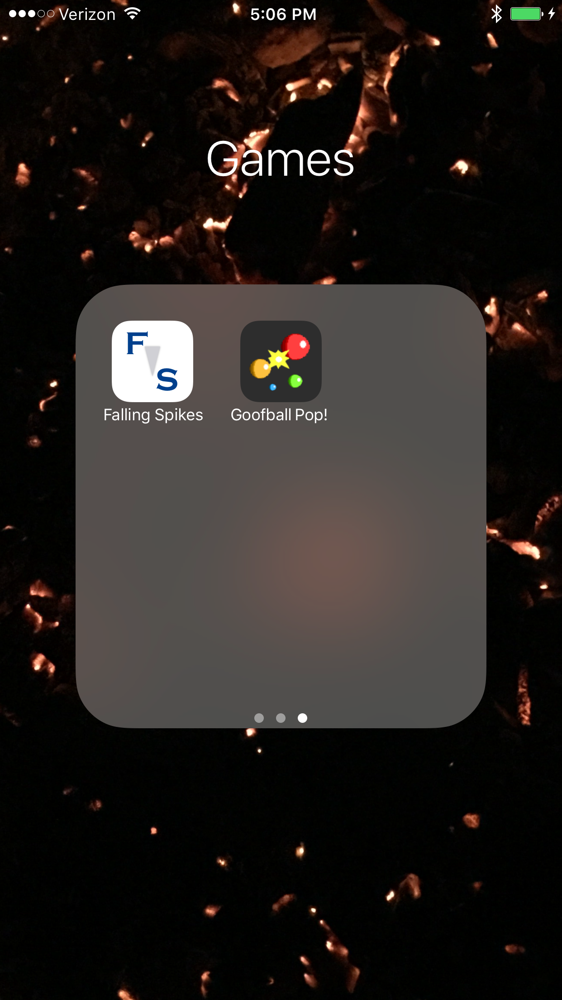

Tyler Mumford  
West Haven, UT  
Computer Science  
Creativity Center

## Falling Spikes

I’m a software developer with a four-year background in making websites. For this project, I wanted to try branching out and learning something new. I also wanted to make something that would look good in my portfolio—something easy to show off. Since I’ve always loved the idea of making apps, and I was enrolled in the Writing About Video Games course, I decided to try making an iPhone game for the first time.

Falling Spikes is a simple game where the player controls the sideways movement of an always-bouncing ball. As time goes on, a number of spikes fall from the top of the screen while the player tries to dodge them all. The spikes start to fall faster and faster until the player is hit and then scored based on survival time.

The idea for this game actually came from my friend, Scott Chapman. He’s a business student who has also dabbled in making small games like this. Since he’d only had experience making games that work on the computer, I offered to make this game for iOS as an EDGE project. 

The iOS App Development course taught me most of what I needed to know about iPhone development, and I taught myself game development principles on the side. Whenever things got tricky, I talked with other game-making classmates and we worked out issues together. The hardest part for me was working with the graphics. While I’ve dabbled in app development before, graphics programming was completely new to me. I had to do a lot of studying to figure it out.

Scott and I became partners, so we both benefit from the game’s App Store release. Falling Spikes is the first game either of us has published. I also consider everyone who downloads the game to be a benefactor of the project, since they get to play a fun game!

For myself, the main benefit is experience. Having always worked in a web development world, branching out is a great way to show employers that I have the skills they need and the capacity to learn. It also helps me by being in my professional portfolio; as one of my most ambitious projects, it demonstrates skill as a developer. Plus I had fun making it!

